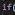

<h1 align="center">
</h1>

<i><b>Connecting Cultures, Creating Community: Your Gateway to the Local Cultural World.</b></i>

Software system to help councils promote culture in their municipality.

  

  

<!--
|          Members         |                   GitHub User                |
|--------------------------|:--------------------------------------------:|
| Aragón Hidalgo, Arturo   | [@artHub-j](https://github.com/artHub-j)     |
| Álvarez Strohmeier, Eric | [@3R1C2001](https://github.com/3R1C2001)     |
| Escala Jané, Ferran      | [@FerranEJ](https://github.com/FerranEJ)     |
| Nevado Lancha, Alejandro | [@Ha1r1to](https://github.com/Ha1r1to)       |
| Ghaffarzadeh, Nima       | [@nghaffar21](https://github.com/nghaffar21) |
| Chaparro Redondo, Gerard | [@ProGer211](https://github.com/ProGer211)   |
| Jiménez Prado, Jesika    | [@jesikajz](https://github.com/jesikajz)     |
| Vila Monge, Xavier       | [@xvimo](https://github.com/xvimo)           |  
-->

## UI 

## Actualització 30 Abril 2024:

#### Ara es mostren tots els Esdeveniments possibles a l'obrir l'aplicació (pàgina Homepage). Al filtrar (Botons Gala, Desportivo, etc.) es mostren únicament els Esdeveniments amb el tipus esmentat.
#### Cada Esdeveniment té el seu propi Panel amb les seves dades. Apareixen iterativament amb l'ús d'un FlowPanel.

### 1. Form Login:

### 2. Main Form:

## Our Team

<table> 
  <tr>
    <td align="center">
      <a href="https://github.com/artHub-j">
         
        <b>@artHub-j</b>
      </a> 
      Arturo Aragón
       <b> (Position) </b> 
    </td> <!-- --------------------------------------------------------------------------------------------------------------------------------------- -->
    <td align="center">
      <a href="https://github.com/3R1C2001">
         
        <b>@3R1C2001</b>
      </a> 
      Eric Álvarez
       <b> (Position) </b> 
    </td> <!-- --------------------------------------------------------------------------------------------------------------------------------------- -->
    <td align="center">
      <a href="https://github.com/FerranEJ/">
         
        <b>@FerranEJ</b>
      </a> 
      Ferran Escala
       <b> (Position) </b> 
    </td> <!-- --------------------------------------------------------------------------------------------------------------------------------------- -->
    <td align="center">
      <a href="https://github.com/Ha1r1to">
         
        <b>@Ha1r1to</b>
      </a> 
      Alejandro Nevado
       <b> (Position) </b> 
    </td> <!-- --------------------------------------------------------------------------------------------------------------------------------------- -->
    <td align="center">
      <a href="https://github.com/nghaffar21">
         
        <b>@nghaffar21</b>
      </a> 
      Nima Ghaffarzadeh
       <b> (Position) </b> 
    </td> <!-- --------------------------------------------------------------------------------------------------------------------------------------- -->
    <td align="center">
      <a href="https://github.com/ProGer211">
         
        <b>@ProGer211</b>
      </a> 
      Gerard Chaparro
       <b> (Position) </b> 
    </td> <!-- --------------------------------------------------------------------------------------------------------------------------------------- -->
    <td align="center"> 
      <a href="https://github.com/jesikajz">
         
        <b>@jesikajz</b>
      </a> 
      Jesika Jiménez
       <b> (Position) </b> 
    </td> <!-- --------------------------------------------------------------------------------------------------------------------------------------- -->
    <td align="center">
      <a href="https://github.com/xvimo">
         
        <b>@xvimo</b>
      </a> 
      Xavier Vila
       <b> (Position) </b> 
    </td> <!-- --------------------------------------------------------------------------------------------------------------------------------------- -->
  </tr>
</table>
